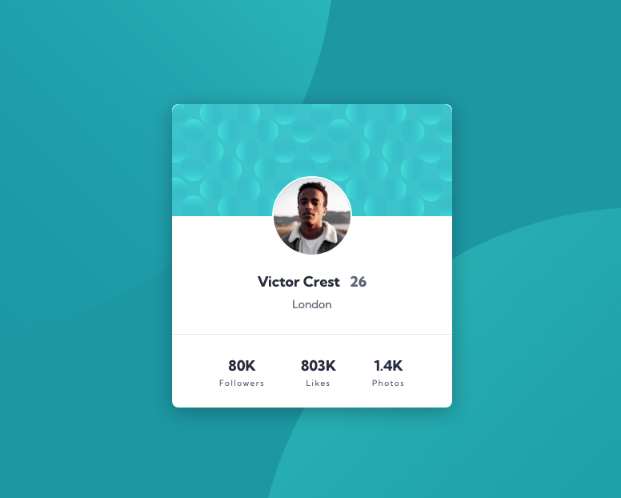

# Frontend Mentor - Profile card component solution

This is a solution to the [Profile card component challenge on Frontend Mentor](https://www.frontendmentor.io/challenges/profile-card-component-cfArpWshJ). Frontend Mentor challenges help you improve your coding skills by building realistic projects.

## Table of contents

- [Overview](#overview)
  - [Screenshot](#screenshot)
  - [Links](#links)
- [My process](#my-process)
  - [Built with](#built-with)
  - [What I learned](#what-i-learned)
- [Author](#author)

### Screenshot

### Links

- Solution URL: [Frontend Mentor solution](https://www.frontendmentor.io/challenges/profile-card-component-cfArpWshJ/hub/profile-card-component-3MDLs8-cLY)
- Live Site URL: [Live site at Netlify](https://profile-card-fb2f9d.netlify.app/)

## My process

### Built with

- Semantic HTML5 markup
- CSS custom properties
- Flexbox
- CSS Grid
- BEM
- SASS

### What I learned

I learned how to add multiple css background images to the body

## Author

- Frontend Mentor - [@JGedd](https://www.frontendmentor.io/profile/JGedd)
- Twitter - [@John_geddis](https://twitter.com/john_geddis)
